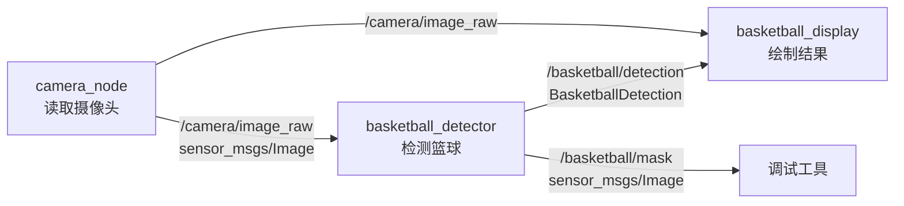
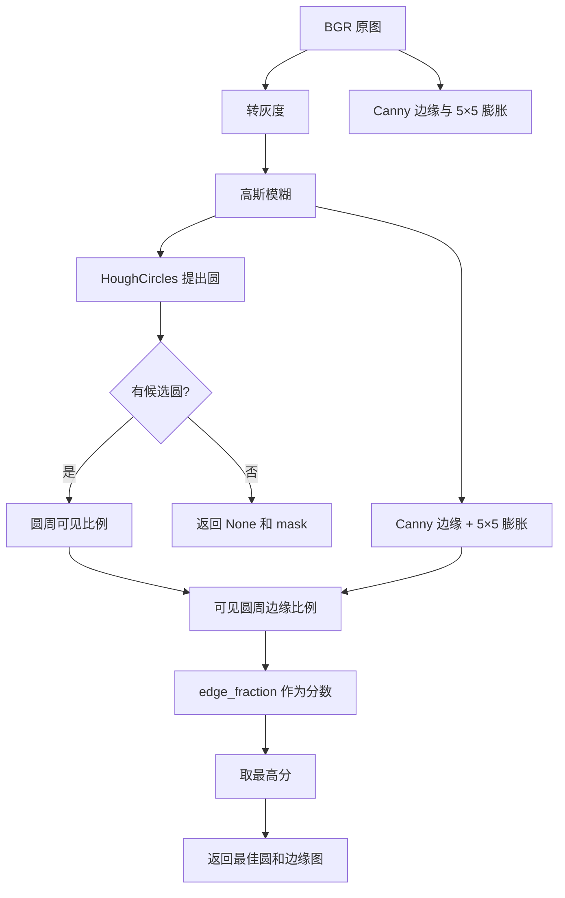

# ROS 2 篮球识别：纯霍夫测试分支的节点与算法逻辑

本文按一帧图像从摄像头到显示窗口的实际执行顺序解释代码。 当前文档对应 `hough_only_test` 分支；该分支已经删除 HSV 颜色验证和颜色权重，只保留霍夫候选与圆周边缘支持率。对应的工作空间是 `basketball_ws_hough`；运行命令和快速调参见 [README](../README.md)。文中的片段摘自当前实现，省略了与该步骤无关的行；以源码为准。

## 1. 先看整体：三个节点和一个接口包



| 部分 | 源文件 | 职责 |
| --- | --- | --- |
| 摄像头节点 | [`camera_node.py`](../src/basketball_cv/basketball_cv/camera_node.py) | 采集 BGR 图像，转换成 ROS `Image` 并发布。 |
| 检测节点 | [`detector_node.py`](../src/basketball_cv/basketball_cv/detector_node.py) | 读取图像和参数，调用纯图像算法，发布检测消息及颜色 mask。 |
| 图像算法 | [`circle_detection.py`](../src/basketball_cv/basketball_cv/circle_detection.py) | 霍夫找圆、边缘和颜色验证、给候选圆评分。它不是 ROS 节点。 |
| 显示节点 | [`display_node.py`](../src/basketball_cv/basketball_cv/display_node.py) | 在画面上绘制矩形、圆、圆心和分数。 |
| 接口包 | [`BasketballDetection.msg`](../src/basketball_interface/msg/BasketballDetection.msg) | 定义检测结果的数据结构。 |
| 启动入口 | [`basketball_system.launch.py`](../src/basketball_cv/launch/basketball_system.launch.py) | 启动三个节点，加载统一的参数文件。 |

`/basketball/mask` 是膨胀后的 Canny 边缘调试图；显示节点目前只订阅原始图像和检测消息，不订阅它。检测节点每帧最多选择一个篮球。

## 2. 启动时：Launch 和 YAML 参数怎样进入节点

Launch 先通过 `get_package_share_directory('basketball_cv')` 找到安装后的包目录，再把 `config/params.yaml` 作为默认参数文件。它声明 `params_file` 启动参数，并将该文件传给三个 `Node(...)`。因此可以在启动时替换整份参数文件：

```bash
ros2 launch basketball_cv basketball_system.launch.py \
  params_file:=/absolute/path/to/params.yaml
```

参数文件中的顶层名称必须对应节点名：

```yaml
camera_node:
  ros__parameters:
    device_id: 0
    width: 640
    height: 480
    fps: 30

basketball_detector:
  ros__parameters:
    dp: 1.2
    param1: 120
    param2: 30
    # 其余检测参数见完整文件

basketball_display:
  ros__parameters:
    display_fps: 30.0
```

完整默认值见 [`params.yaml`](../src/basketball_cv/config/params.yaml)。直接编辑 YAML 后要重新启动 launch，才能把文件值重新加载到节点；已声明的检测参数也可通过 ROS 参数服务动态修改，因为检测回调会逐帧读取参数。

## 3. 摄像头节点：从设备到 `/camera/image_raw`

### 3.1 初始化摄像头

`CameraNode.__init__` 先声明并读取 `device_id`、`width`、`height`、`fps`。`fps <= 0` 会抛出错误。接着调用：

```python
self.cap = cv2.VideoCapture(device_id)
self.cap.set(cv2.CAP_PROP_FRAME_WIDTH, width)
self.cap.set(cv2.CAP_PROP_FRAME_HEIGHT, height)
self.cap.set(cv2.CAP_PROP_FPS, fps)
```

`device_id: 0` 通常表示系统中的第一个摄像头。`cap.isOpened()` 为假时，节点记录错误并退出。`set` 是对驱动的请求，实际输出尺寸或帧率可能由摄像头能力决定。

### 3.2 定时采集和发布

定时器周期是 `1.0 / fps` 秒。默认 `fps: 30` 时，约每 33 毫秒触发一次 `timer_callback`：

```python
ret, frame = self.cap.read()
if not ret:
    return
msg = self.bridge.cv2_to_imgmsg(frame, encoding='bgr8')
msg.header.stamp = self.get_clock().now().to_msg()
msg.header.frame_id = 'camera'
self.pub.publish(msg)
```

`frame` 是 OpenCV 的 BGR 像素矩阵。`CvBridge` 把它包装成 ROS `sensor_msgs/Image`；`header.stamp` 标记这一帧，供后续结果关联。节点退出时释放摄像头。它不做篮球检测，也不修改像素颜色。

## 4. 检测节点：参数、订阅和回调

### 4.1 声明检测参数

检测参数集中在 `CircleConfig` 数据类中，例如：

```python
@dataclass(frozen=True)
class CircleConfig:
    dp: float = 1.2
    min_dist: int = 70
    param1: int = 120
    param2: int = 30
    min_radius: int = 18
    max_radius: int = 0
    # 还有圆周边缘与可见比例阈值
```

节点用字段名循环声明参数：

```python
defaults = CircleConfig()
for name in defaults.__dataclass_fields__:
    self.declare_parameter(name, getattr(defaults, name))
```

这样 YAML 中的 `param2`、`h_min` 等字段可覆盖默认值。每次收到图像，节点从 ROS 参数表读取当前值，再构造 `CircleConfig`。图像算法本身只接受普通数组和配置对象，因此无需启动 ROS 就能单独测试。

### 4.2 收到一帧时

```python
bgr = self.bridge.imgmsg_to_cv2(msg, desired_encoding='bgr8')
config = CircleConfig(**{
    name: self.get_parameter(name).value
    for name in CircleConfig.__dataclass_fields__
})
circle, mask = find_basketball(bgr, config)
```

`circle` 是最高分的 `CircleResult(x, y, radius, score)`；如果没有通过筛选的圆，则是 `None`。`mask` 是膨胀后的 Canny 边缘图。图像转换或算法抛出已处理的错误时，节点会记录日志并跳过该帧，不发布它的检测结果。

## 5. 核心算法：`find_basketball` 的完整处理链



### 5.1 输入检查

空图像会抛出 `ValueError`。`dp`、`min_dist` 必须大于零，半径不能为负；`max_radius` 若非零，不能小于 `min_radius`。这些检查在进入 OpenCV 前完成。

### 5.2 灰度化与高斯模糊

```python
blur_size = max(3, int(config.blur_kernel) | 1)
gray = cv2.cvtColor(bgr, cv2.COLOR_BGR2GRAY)
gray = cv2.GaussianBlur(gray, (blur_size, blur_size), 0)
```

霍夫圆检测依赖亮度边缘和梯度方向，所以先使用灰度图。高斯模糊压低表面纹理、缝线的小范围噪声和摄像头噪声。核大小必须是正奇数；代码用位运算把偶数升到下一个奇数，并确保至少为 3。例如 `6 → 7`、`2 → 3`。过大的核也会把球外缘一起抹弱。

### 5.3 霍夫圆变换找候选圆

```python
circles = cv2.HoughCircles(
    gray, cv2.HOUGH_GRADIENT,
    dp=config.dp,
    minDist=config.min_dist,
    param1=config.param1,
    param2=config.param2,
    minRadius=config.min_radius,
    maxRadius=config.max_radius,
)
```

一个圆由圆心 `(x, y)` 和半径 `r` 描述：`(X - x)² + (Y - y)² = r²`。`HOUGH_GRADIENT` 根据图像边缘的梯度方向，为可能的圆心和半径投票；超过阈值的组合成为候选圆。返回值是若干 `(x, y, r)`；没有候选时返回 `None`。

这个阶段直接在灰度边缘上提出圆，不使用颜色连通区域。篮球表面有黑色缝线时，只要外缘有足够圆形证据，霍夫检测仍能提出候选。严重遮挡、失焦、反光或背景与外缘对比太低，仍可能导致霍夫阶段漏检。

### 5.4 纯霍夫分支不使用 HSV

这个测试分支不执行 `cv2.cvtColor(..., COLOR_BGR2HSV)`，不创建橙色 mask，也不计算 `color_fraction`。`/basketball/mask` 话题仍然保留，内容改为膨胀后的 Canny 边缘图，便于观察几何边缘。颜色、肤色、亮度和饱和度不会影响候选是否通过；这正是该分支用来测试的内容。

因此，暗环境下篮球颜色变深不会被 HSV 阈值直接过滤，但背景和手部的圆形边缘也不会被颜色排除。测试结果应重点观察霍夫候选数量和 `edge_fraction`，不能直接拿它替代亮环境版或暗环境版。

### 5.5 独立计算 Canny 边缘

```python
edges = cv2.Canny(gray, config.param1 // 2, config.param1)
edges = cv2.dilate(edges, np.ones((5, 5), np.uint8))
```

`HoughCircles` 内部已经用边缘信息找圆；这里再次显式计算 Canny，是为了检查每个候选圆的圆周是否有真实边缘。Canny 的低阈值是 `param1 // 2`，高阈值是 `param1`。默认大致为 60 和 120。

`5×5` 膨胀只作用于**边缘图**，不是对橙色 mask 填缝。它让预测圆周偏离真实边缘少量像素时仍能计入支持点。

### 5.6 圆周取样与画面边缘处理

每个候选圆沿 `0..2π` 均匀取样：

```python
samples = max(120, int(2 * np.pi * radius / 2))
angles = np.linspace(0, 2 * np.pi, samples, endpoint=False)
px = np.rint(x + radius * np.cos(angles)).astype(int)
py = np.rint(y + radius * np.sin(angles)).astype(int)
visible = (px >= 0) & (px < width) & (py >= 0) & (py < height)
```

也就是半径越大，圆周取样点越多，但至少 120 个。`visible` 表示哪些圆周点位于画面内。第一道筛选计算 `mean(visible)`；低于 `min_visible_fraction` 就丢弃。例如阈值 `0.55` 表示至少 55% 的取样圆周点必须在画面内。

这一步允许近距离球在画面边缘被裁掉一部分。**允许圆被截断不保证霍夫阶段一定能提出这个圆**；后续的可见比例只筛选已提出的候选。

### 5.7 圆周边缘支持率

只对画面内的采样点计算：

```python
edge_fraction = np.mean(edges[py[visible], px[visible]] > 0)
if edge_fraction < config.min_edge_fraction:
    continue
```

公式为：

```text
edge_fraction = 有边缘的可见圆周采样点数 / 可见圆周采样点总数
```

默认下限 `0.18`。颜色相近但外形不够圆的物体，理论上圆周支持率较低；不过并非所有人脸都会被拒绝，脸部轮廓和背景也可能形成足够的圆边缘。

### 5.8 （本分支删除）颜色比例

本分支没有内圆 HSV 统计，也没有 `min_color_fraction` 门槛；候选只由可见比例和圆周边缘支持率决定。`min_score` 与 `min_edge_fraction` 都是几何阈值。

### 5.9 评分、选优和返回

```python
score = edge_fraction
if score >= config.min_score and (best is None or score > best.score):
    best = CircleResult(x, y, radius, float(score))
return best, color_mask
```

先分别通过可见比例、边缘比例和颜色比例门槛，再比较加权分数。默认 `min_score=0.40`。一帧中可能有多个候选圆，算法只保留分数最高的一个。`score` 在 0 到 1 之间，但**它是手工规则分数，不是“识别概率”**。例如 `0.80` 不能解释为篮球概率 80%。

本分支没有边缘与颜色的加权；`score` 就是 `edge_fraction`。因此它不能依靠颜色排除手部或浅橙背景，也没有人脸分类器、篮球纹理模型或跨帧跟踪。

## 6. 检测结果如何变成 ROS 消息

检测节点为每帧创建一个 `BasketballDetection`，继承原始图像的 `header`，把 `detected` 设为 `circle is not None`。有检测结果时填写：

```python
result.center_x = circle.x
result.center_y = circle.y
result.radius = circle.radius
result.confidence = circle.score
```

接口文件的字段依次是：

```text
std_msgs/Header header
bool detected
float32 center_x
float32 center_y
float32 radius
int32 x
int32 y
int32 width
int32 height
float32 confidence
```

`header` 让下游知道结果对应哪一帧；`center_x/center_y/radius` 描述圆，`x/y/width/height` 描述轴对齐的显示框。

外接框来自圆的外接正方形，但各边被裁剪到图像范围。实际计算相当于：

```text
左上角 x = max(0, int(cx - r))
左上角 y = max(0, int(cy - r))
右边界   = min(图像宽度, int(cx + r) + 1)
下边界   = min(图像高度, int(cy + r) + 1)
width    = 右边界 - x
height   = 下边界 - y
```

注意 `minEnclosingCircle` 没有参与本方案：霍夫算法给出的 `(cx, cy, r)` 直接用于画圆和算框。没有检测结果时，`detected=false`，其他数值字段保留消息默认值。

随后发布 `/basketball/detection`。边缘图用 `encoding='mono8'` 转为 ROS `Image`，复制同一帧的 `header`，发布到 `/basketball/mask`。mask 里的白色表示 Canny 边缘，不表示篮球最终被检出。

## 7. 显示节点如何画结果

显示节点分别订阅 `/camera/image_raw` 和 `/basketball/detection`。图像回调保存 `latest_image`，检测回调保存 `latest_det`。`display_fps` 决定渲染定时器频率，默认 30 帧每秒。

渲染时先复制最近的图像。如果最近的检测消息 `detected=true`，就用消息中的 `x/y/width/height` 画绿色矩形，用 `center_x/center_y/radius` 画红色圆，用蓝点标圆心，再显示 `Basketball {confidence:.2f}`。否则画 `No basketball`。`cv2.imshow` 打开显示窗口，`cv2.waitKey(1)` 处理窗口事件；节点结束时销毁窗口。

对应的绘制调用是：

```python
cv2.rectangle(bgr, (x, y), (x + w, y + h), (0, 255, 0), 2)
cv2.circle(bgr, (cx, cy), r, (0, 0, 255), 2)
cv2.circle(bgr, (cx, cy), 3, (255, 0, 0), -1)
cv2.putText(
    bgr, f'Basketball {det.confidence:.2f}', (x, y - 10),
    cv2.FONT_HERSHEY_SIMPLEX, 0.6, (0, 255, 0), 2,
)
```

这里 OpenCV 颜色仍采用 BGR 顺序，所以 `(0, 255, 0)` 是绿色、`(0, 0, 255)` 是红色。

这里保存的是“最新图像”和“最新检测”，**没有按 `header.stamp` 配对**。检测处理或消息传输有延迟时，框可能短暂画在下一帧图像上。因此显示窗口适合实时观察，但不能把屏幕上的每一帧当成严格同步的评估样本。

## 8. 参数完整解释与调节顺序

以下默认值来自 [`params.yaml`](../src/basketball_cv/config/params.yaml)，按 640×480 摄像头给出初始值。相机距离、光照和篮球颜色不同，最佳值也会不同。

| 参数 | 默认 | 实际作用 | 如何调整 |
| --- | ---: | --- | --- |
| `dp` | 1.2 | 霍夫累加器相对原图的分辨率比例。 | 增大通常加快计算，但圆心可能更粗糙；一般先保持。 |
| `min_dist` | 70 | 候选圆心之间的最小距离，单位像素。 | 同一球出现多个候选圆时增大；相邻两个球被合并时减小。 |
| `param1` | 120 | 霍夫内部 Canny 的高阈值，也用于显式的二次 Canny。 | 弱边缘漏检时降低；背景边缘噪声多时提高。 |
| `param2` | 30 | 霍夫圆投票阈值。 | 球根本没有成为候选时逐步降低，如 30→28→26；候选过多时提高。 |
| `min_radius` | 18 | 霍夫搜索的最小半径，单位像素。 | 远处小球漏检时减小；小圆误检多时增大。 |
| `max_radius` | 0 | 霍夫搜索的最大半径。OpenCV 中 `0` 表示采用内部默认范围。 | 近距离大球先保持 0；知道最大尺寸后可限制范围。 |
| `blur_kernel` | 7 | 灰度高斯模糊核边长。 | 纹理干扰大时增大；轮廓被抹弱时减小。 |
| `min_visible_fraction` | 0.55 | 圆周点至少有多少比例在画面内。 | 边缘截断的大球被筛掉时降低；极少量可见弧误检时提高。 |
| `min_edge_fraction` | 0.18 | 可见圆周点的最低边缘命中比例。 | 肤色目标误检时提高；球外缘弱时降低。 |
| `min_score` | 0.40 | 最终规则分数下限。 | 前面各单项阈值已经合理后再调。 |
| `display_fps` | 30.0 | 显示节点渲染频率。 | 仅影响显示刷新，不改变检测算法。 |

推荐调节步骤：

1. **确认摄像头实际画面尺寸和篮球像素半径。** 先确定 `min_radius/max_radius`，不要用不适合当前距离的搜索范围。
2. **看霍夫是否提出圆。** 漏检时先试 `param2`，再看外缘太弱是否需要调整 `param1` 或 `blur_kernel`。只修改颜色阈值无法修复霍夫阶段没有候选的问题。
3. **看 `/basketball/mask`。** 本分支的 mask 是边缘图，不是橙色 mask；观察篮球圆周是否连续，以及手部和背景是否也有强圆边缘。
4. **区分误检与漏检来源。** 颜色接近的人脸被选中时，观察其圆周是否有边缘支持；先调 `min_edge_fraction`，再调 `min_score`。大球被画面截断时看 `min_visible_fraction`。
5. **以真实样本复测。** 在只有篮球、只有人脸、两者同框、球远近变化、运动模糊和不同光线下记录检出与误检情况，再固定参数。

## 9. 与有颜色验证版本的关系

亮环境版和暗环境版在霍夫候选之后还使用 HSV 颜色比例；本分支刻意删除这一步，用来单独测试几何检测。

| 步骤 | 亮/暗环境版 | 当前 `hough_only_test` |
| --- | --- | --- |
| 提出候选 | 灰度图的霍夫圆投票 | 灰度图的霍夫圆投票 |
| 几何证据 | 圆周边缘支持率 | 圆周边缘支持率 |
| 颜色证据 | 内圆颜色比例和 HSV 门槛 | 无 |
| 分数 | `0.65 × edge + 0.35 × color` | `edge_fraction` |
| 预期优点 | 颜色可过滤手部和背景 | 不受亮暗、棕褐色变化影响 |
| 预期风险 | HSV 参数不合适会漏检 | 圆形手部和背景误检可能增加 |

`hough_only_test` 不应该直接覆盖亮环境版或暗环境版；它的目的，是确认在不依赖颜色时霍夫几何证据的上限和误检情况。

## 10. 验证范围与仍需确认的现象

[`test_circle_detection.py`](../src/basketball_cv/test/test_circle_detection.py) 用合成图像覆盖了深色缝线、画面边缘截断的大球、空白画面，以及球和相近颜色椭圆同时出现时的候选选择。它们验证的是这些可控场景中的实现逻辑。真实摄像头的篮球材质、背景、运动和镜头畸变会改变边缘分布；需要现场样本才能评估识别率。只出现近似圆形的人脸时，当前规则也可能误检。
