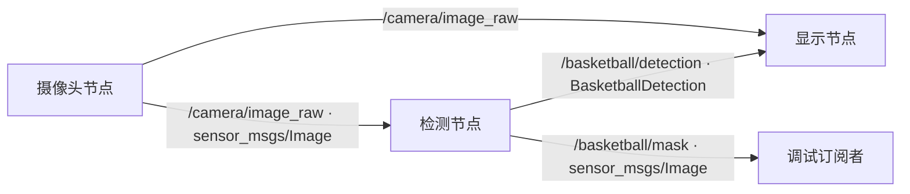

# 篮球识别代码逻辑

本文对应当前 `basketball_ws_hough` 工作空间。README 提供运行命令和调参速查；这里按代码执行顺序说明各节点、图像处理、参数和输出。

## 1. 进程和消息流

`launch/basketball_system.launch.py` 启动三个 ROS 2 节点，并给它们加载同一份 `config/params.yaml`。YAML 中的 `camera_node`、`basketball_detector` 和 `basketball_display` 分别匹配对应节点名。



`/basketball/mask` 没有被显示节点订阅；它供调试 HSV 阈值使用。消息定义见 [`BasketballDetection.msg`](../src/basketball_interface/msg/BasketballDetection.msg)。每帧最多选一个篮球；`detected=false` 表示本帧没有通过筛选的候选圆。

## 2. 摄像头节点

[`camera_node.py`](../src/basketball_cv/basketball_cv/camera_node.py) 在初始化时读取 `device_id`、`width`、`height`、`fps`，通过 `cv2.VideoCapture(device_id)` 打开摄像头并设置采集属性。`fps` 必须大于零；摄像头打开失败会使节点退出。

定时器周期是 `1 / fps` 秒。每次回调读取一帧 BGR 图像，使用 `CvBridge` 转成 `bgr8` 的 ROS `Image`，写入采集时间戳及 `frame_id='camera'`，发布到 `/camera/image_raw`。摄像头不保证一定能按请求的尺寸和帧率工作；驱动可能选择它支持的实际值。

## 3. 检测节点怎样调用算法

[`detector_node.py`](../src/basketball_cv/basketball_cv/detector_node.py) 订阅 `/camera/image_raw`。`CircleConfig` 中的每个字段都会声明为 ROS 参数；收到图像时，节点读取当前参数值并构造一个 `CircleConfig`，因此运行时改变参数会作用于后续帧。

回调先把 ROS `Image` 转为 OpenCV BGR 数组，再调用 `find_basketball(bgr, config)`。算法返回最高分候选圆或 `None`，以及一张 HSV 颜色 mask。转换或算法出错时会记录日志并跳过该帧。

检测节点与算法分开：前者只处理 ROS 消息和话题，后者在 [`circle_detection.py`](../src/basketball_cv/basketball_cv/circle_detection.py) 中处理 NumPy/OpenCV 图像。这使算法能够脱离摄像头做合成图像测试。

## 4. 霍夫圆检测的逐帧流程

### 4.1 灰度化与模糊

输入 BGR 图像先转灰度，再做高斯模糊。`blur_kernel` 会取不小于 3 的奇数：例如 `6` 会变成 `7`。模糊削弱球面纹理、缝线与传感器噪声，使外轮廓更容易形成稳定的圆投票。

### 4.2 霍夫变换提出候选圆

调用 `cv2.HoughCircles(gray, cv2.HOUGH_GRADIENT, ...)`。圆由圆心 `(x, y)` 和半径 `r` 描述，满足 `(X-x)² + (Y-y)² = r²`。算法利用灰度图的边缘及梯度方向，对可能的圆心和半径累积投票，返回若干候选圆。

此时**尚未使用橙色 mask 找轮廓**，也没有对 mask 做开闭运算。因此黑色缝线不必被填成橙色才能形成一个连通区域。不过，如果缝线、遮挡或失焦让外轮廓太弱，霍夫算法仍可能找不到圆。

### 4.3 生成颜色 mask

原始 BGR 图像转换为 HSV，用 `h_min..h_max`、`s_min..255`、`v_min..v_max` 生成二值 mask：范围内为白色，其余为黑色。即使霍夫变换未找到圆，函数也返回该 mask。它只用于候选验证和调试，并不进入霍夫变换。

### 4.4 计算圆周边缘支持率

对模糊后的灰度图再次运行 Canny，阈值分别为 `param1 // 2` 和 `param1`；随后用 `5×5` 核膨胀边缘，容许候选圆周与真实边缘相差约几像素。这里的 Canny 是**二次验证**，与 `HoughCircles` 内部使用的边缘处理是两个调用。

每个候选圆沿 `0..2π` 均匀取样，点数是 `max(120, floor(2πr/2))`。首先计算落在画面内的采样点比例；小于 `min_visible_fraction` 的候选被丢弃。随后只在画面内的圆周点上计算：

```text
edge_fraction = 附近有 Canny 边缘的可见圆周点数 / 可见圆周点数
```

低于 `min_edge_fraction` 就丢弃。允许部分圆周超出画面，是为了兼容靠近画面边缘的大球；超出过多时仍无法检出。

### 4.5 计算球面颜色比例

以同一圆心取半径为 `0.85r` 的内圆，避开外缘混入的背景和抗锯齿像素。内圆与图像相交的部分用于统计：

```text
color_fraction = 内圆内符合 HSV 范围的像素数 / 内圆内可见像素数
```

低于 `min_color_fraction` 就丢弃。黑色缝线可以占据部分球面，因为条件要求的是橙色比例，而非内部每个像素都为橙色。

### 4.6 评分并选一个圆

通过可见比例、边缘比例和颜色比例三个门槛后，计算：

```text
score = 0.65 × edge_fraction + 0.35 × color_fraction
```

只有 `score >= min_score` 的候选会参与比较；分数最高者成为该帧结果。`confidence` 就是这个规则分数，**不是经过标定的识别概率**。偏圆且颜色相近的人脸仍可能误检，尤其在画面中没有篮球时；当前代码没有人脸分类器或跨帧跟踪。

## 5. 检测结果和显示

检测节点将原图 `header` 复制到检测消息和 mask。检出时填写圆心、半径、得分，并根据圆的外接正方形计算 `x/y/width/height`；外接框会裁剪到图像边界。未检出时仍发布 `detected=false` 的消息及颜色 mask。

[`display_node.py`](../src/basketball_cv/basketball_cv/display_node.py) 保存最近收到的一帧图像和最近的检测消息，每隔 `1 / display_fps` 秒复制图像并绘制。检出时画绿色外接框、红色圆、蓝色圆心和分数；否则显示 `No basketball`。显示节点目前**没有按时间戳同步**这两个话题，所以处理延迟时框可能短暂落在下一帧图像上。

## 6. 参数如何影响检测

默认值及注释见 [`params.yaml`](../src/basketball_cv/config/params.yaml)。以下都是 640×480 图像下的起始值，实际应结合摄像头画面调整。

| 参数 | 默认值 | 作用与调整方向 |
| --- | ---: | --- |
| `dp` | 1.2 | 霍夫累加器相对图像的分辨率；增大通常更快，但圆心定位更粗。 |
| `min_dist` | 70 | 两个候选圆心最小距离，单位像素；抑制同一球的重复圆。 |
| `param1` | 120 | 霍夫内部 Canny 的高阈值，也用于二次验证的 Canny；降低可保留较弱边缘，也可能增加噪声。 |
| `param2` | 30 | 霍夫圆投票阈值；降低更容易提出候选，也更容易误检。 |
| `min_radius` / `max_radius` | 18 / 0 | 搜索半径范围，单位像素；`max_radius=0` 表示交给 OpenCV 自动处理最大半径。 |
| `blur_kernel` | 7 | 高斯模糊核；过大可能抹去弱轮廓。 |
| `h_min/h_max` | 3 / 25 | HSV 色相范围；决定哪些像素被视为橙色。 |
| `s_min` | 85 | 饱和度下限；提高可排除浅灰、浅白区域。 |
| `v_min/v_max` | 35 / 220 | 明度范围；控制过暗和过亮区域是否进入 mask。 |
| `min_visible_fraction` | 0.55 | 候选圆周至少有多少比例在画面内；降低可接受更多截断。 |
| `min_edge_fraction` | 0.18 | 可见圆周需要有边缘的最低比例；提高可减少误检，也可能漏检弱轮廓。 |
| `min_color_fraction` | 0.28 | 内圆的最低橙色比例；提高可减少非橙色误检，暗缝多时可能漏检。 |
| `min_score` | 0.40 | 最终加权分数下限；在各单项阈值合理后再调整。 |

建议先确认球在画面中的像素半径，再调 `param2` 控制候选数量；然后观察 `/basketball/mask` 调 HSV，最后调整圆周和颜色的接受阈值。参数文件在启动时加载；修改 YAML 后需要重新启动 launch。当前节点按帧读取 ROS 参数，也可以通过 ROS 参数服务动态修改已声明参数。

## 7. 当前验证范围

[`test_circle_detection.py`](../src/basketball_cv/test/test_circle_detection.py) 使用合成图像检查带深色缝线的球、画面边缘被截断的大球、空白帧，以及球与相近颜色椭圆同时出现时的候选选择。这些测试证明代码在这些构造案例上工作；真实摄像头光照、皮肤颜色、运动模糊和镜头畸变仍需现场验证。
